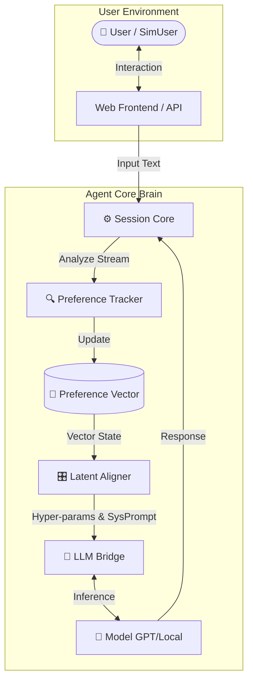

<div align="center">

# 🧠 Human-Preference-Tracking Conversational Agent

**[ Dynamic Alignment · Anthropomorphic Memory · Dual-Process System ]**

[](https://www.python.org/downloads/)
[](https://fastapi.tiangolo.com/)
[](https://openai.com/)
[](./LICENSE)

<p>
    <a href="#en"><b>🇺🇸 English Documentation</b></a> •
    <a href="#cn"><b>🇨🇳 中文文档</b></a>
</p>

</div>

---

<div id="en"></div>

## 🇺🇸 English Documentation

### 📖 Introduction
**HPT-Agent** is a cutting-edge conversational framework designed to solve the "amnesia" and "inconsistency" problems in long-term LLM interactions. By integrating **Real-time Preference Tracking** and **Latent Alignment**, this agent evolves its personality and communication strategy to fit the user's implicit needs.

### ✨ Key Features

| 🔥 Dynamic Preference Tracking | 🎛️ Latent Alignment |
| :--- | :--- |
| **Beyond Static Profiles.** The system calculates a real-time `User Embedding` based on semantic streams, capturing subtle shifts in emotion, topic interest, and logic depth. | **Abstract-to-Concrete Mapping.** A unique layer that mathematically maps the abstract "Preference Vector" to concrete LLM control parameters (Temperature, Verbosity, Tone). |

| 🧬 Anthropomorphic Simulation | 🧠 Dual-Loop Architecture |
| :--- | :--- |
| Built-in `UserEnv` based on **Big Five Personality Traits** for high-throughput reinforcement learning (RL) or A/B testing without human intervention. | A robust state machine (`Session Core`) that manages the conversation loop separately from the cognitive preference update loop. |

### 🛠️ System Architecture

The system utilizes a dual-loop mechanism: the **Interaction Loop** handles dialogue, while the **Cognitive Loop** manages preference updates.



### ⚡ Quick Start

1.  **Clone & Install**
    ```bash
    git clone [https://github.com/wusuiling-if/Human-Preference-Tracking-Conversational-Agent.git](https://github.com/wusuiling-if/Human-Preference-Tracking-Conversational-Agent.git)
    pip install -r requirements.txt
    ```

2.  **Setup Key**
    ```bash
    export OPENAI_API_KEY="sk-xxxx..."
    ```

3.  **Run Demo**
    ```bash
    python web_server.py
    # Visit http://localhost:8000 to see the real-time preference radar.
    ```

---

<div id="cn"></div>

## 🇨🇳 中文文档

### 📖 项目简介
**HPT-Agent** 是一个前沿的智能体框架，致力于解决大模型在长程交互中“遗忘用户个性”的痛点。它通过**实时偏好建模**与**潜变量对齐（Latent Alignment）**，让 AI 能够随着对话深入，自动“进化”出最适合用户的沟通策略，仿佛拥有了“心智”。

### ✨ 核心功能

| 🔥 实时偏好追踪 | 🎛️ 潜变量对齐 (Latent Alignment) |
| :--- | :--- |
| **拒绝静态画像**。系统基于语义流实时计算 `User Embedding`，敏锐捕捉用户在情绪、话题偏好、逻辑深度上的微小变化。 | **独创的参数映射层**。将抽象的“偏好向量”数学化地映射为 LLM 的具体控制参数（如温度、回复长度、语气指令）。 |

| 🧬 拟人化仿真环境 | 🧠 双循环架构 |
| :--- | :--- |
| 内置 `UserEnv`，支持生成具有 **Big Five (大五人格)** 特征的虚拟用户，用于低成本的大规模强化学习 (RL) 训练或 AB 测试。 | 基于 `Session Core` 的状态机管理，将“对话交互”与“认知更新”解耦，确保高并发下的稳定性。 |

### 🛠️ 架构设计

系统采用双循环架构：**外层对话循环**处理交互，**内层认知循环**处理偏好更新与对齐。

> *（详细架构图请参考上文 English Section 的图表，逻辑通用）*

### ⚡ 快速上手

**1. 环境准备**
```bash
git clone [https://github.com/wusuiling-if/Human-Preference-Tracking-Conversational-Agent.git](https://github.com/wusuiling-if/Human-Preference-Tracking-Conversational-Agent.git)
cd Human-Preference-Tracking-Conversational-Agent
pip install -r requirements.txt
```

**2. 配置密钥**
```bash
# Linux / Mac
export OPENAI_API_KEY="sk-xxxx..."

# Windows PowerShell
$env:OPENAI_API_KEY="sk-xxxx..."
```

**3. 启动全栈演示 (Web Dashboard)**
启动后，你将看到一个实时变化的**偏好雷达图**，展示 AI 如何理解你的兴趣。
```bash
python web_server.py
# 访问 http://localhost:8000
```

---

## 📅 路线图 (Roadmap)

- [x] **Phase 1**: 基础架构搭建，实现实时偏好向量更新。
- [x] **Phase 2**: Web 可视化前端，支持 WebSocket 实时数据流。
- [ ] **Phase 3**: 引入 **RLHF (Reinforcement Learning from Human Feedback)** 接口。
- [ ] **Phase 4**: 支持本地量化模型 (Llama 3 / Mistral) 的端侧部署。
- [ ] **Phase 5**: 长期记忆向量库 (Vector DB) 集成。

---

<div align="center">
    <p>Made with ❤️ by wusuiling-if</p>
</div>
